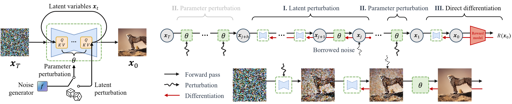

# **Recursive Likelihood Ratio Optimizer**


Official implementation of the paper:  
**Half-order Fine-Tuning for Diffusion Model: A Recursive Likelihood Ratio Optimizer [arXiv Preprint](https://arxiv.org/abs/2502.00639)**


## Overview
The Recursive Likelihood Ratio (RLR) Optimizer is a novel fine-tuning algorithm for diffusion models that intelligently balances computational efficiency with gradient estimation accuracy. Informed by insights from zeroth-order (ZO) optimization, RLR introduces a specially designed half-order (HO) estimator that achieves **unbiased gradient estimation** with **significantly reduced variance** compared to standard ZO methods. By seamlessly integrating this optimized HO estimator with first-order (FO) and ZO estimators in a recursive framework, RLR enables stable and efficient fine-tuning of diffusion models across all time steps. This approach allows RLR to overcome the high memory cost of full backpropagation and the sample inefficiency of reinforcement learning, ensuring robust alignment of diffusion models to downstream tasks with minimal computational overhead.


## News

Our paper has been accepted as oral presentation in ICLR 2026. Codes will be coming soon!

## Citation
If you find this work useful, please cite:

```bibtex
@article{ren2025half,
  title={Half-order Fine-Tuning for Diffusion Model: A Recursive Likelihood Ratio Optimizer},
  author={Ren, Tao and Zhang, Zishi and Jiang, Jingyang and Li, Zehao and Qin, Shentao and Zheng, Yi and Li, Guanghao and Sun, Qianyou and Li, Yan and Liang, Jiafeng and others},
  journal={arXiv preprint arXiv:2502.00639},
  year={2025}
}
```